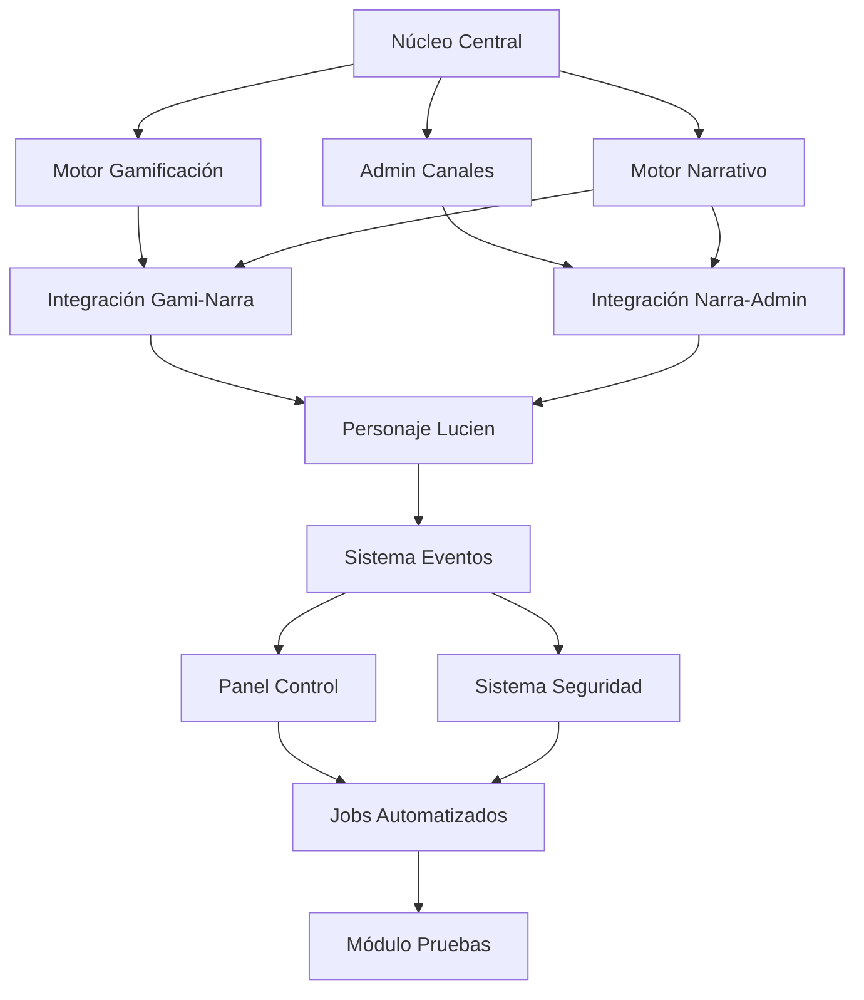

### 🔄 Secuencia de Desarrollo Recomendada

### 📅 Cronograma Estimado (2 semanas)

| Día | Módulos                     | Entregable                             |
|-----|-----------------------------|----------------------------------------|
| 1   | Núcleo Central              | User+EventBus funcionales              |
| 2   | Motor Gamificación          | Puntos y niveles operativos            |
| 3   | Admin Canales               | Gestión VIP básica                     |
| 4   | Motor Narrativo             | Primeras escenas cargables             |
| 5   | Integración Gami-Narra      | Puntos desbloquean fragmentos          |
| 6   | Integración Narra-Admin     | Progreso da acceso VIP                 |
| 7   | Personaje Lucien            | Mensajes personalizados                |
| 8   | Sistema Eventos             | Flujo reacción→puntos→fragmento        |
| 9   | Panel Control               | Métricas básicas                       |
| 10  | Sistema Seguridad           | Protección contenido                   |
| 11  | Jobs Automatizados          | Reset diario de misiones               |
| 12  | Módulo Pruebas              | Validación flujos completos            |

### 💡 Consejos Clave

1. **Desarrollo en Rama**: Crea una rama por módulo (`git checkout -b modulo-gamificacion`)
2. **Integración Continua**: Usa scripts de prueba después de cada módulo
3. **Versionamiento**: Usa tags semánticos (`v0.1-nucleo`, `v0.2-gamificacion`)
4. **Documentación**: Mantén un `ARCHITECTURE.md` actualizado

¡Empecemos con el primer módulo! ¿Quieres que genere el código completo para el **Núcleo Central** usando el prompt proporcionado?
