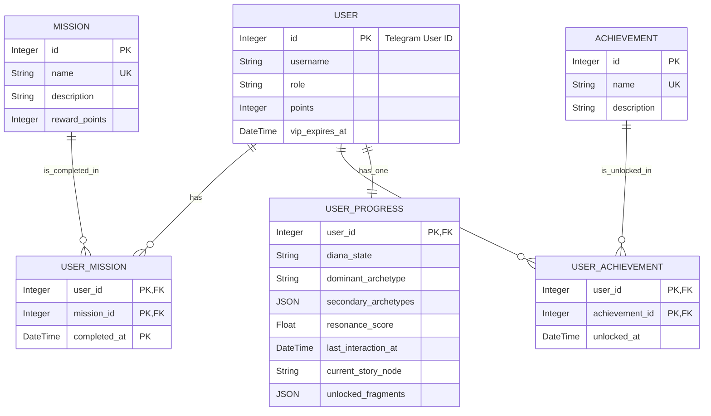

# Diagrama de Entidad-Relación (Schema)

Este documento describe la arquitectura de la base de datos de DianaBot en formato Mermaid.

### Descripción de Relaciones

- **USER - USER_PROGRESS (Uno a Uno):** Cada usuario tiene un único registro de progreso que almacena su estado narrativo y de personalidad. La clave primaria de `USER_PROGRESS` es también una clave foránea a `USER`.

- **USER - USER_MISSION (Uno a Muchos):** Un usuario puede completar muchas misiones. `USER_MISSION` es la tabla intermedia que registra qué misión completó un usuario y cuándo.

- **MISSION - USER_MISSION (Uno a Muchos):** Una misión puede ser completada por muchos usuarios.

- **USER - USER_ACHIEVEMENT (Uno a Muchos):** Un usuario puede desbloquear muchos logros. `USER_ACHIEVEMENT` registra los logros de cada usuario.

- **ACHIEVEMENT - USER_ACHIEVEMENT (Uno a Muchos):** Un logro puede ser obtenido por muchos usuarios.
